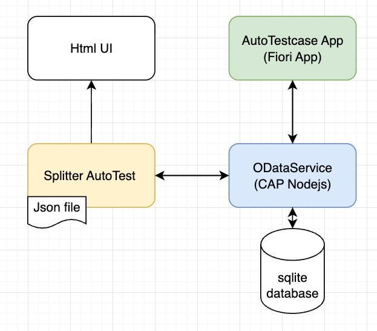

npm install
npm start

# UI5 App Playground

Insert the purpose of this project and some interesting infos here

## Credits

This project has been generated with 💙 and [Easy-UI5](https://github.com/SAP/generator-easy-ui5)

## Dependency
npm i -g @sap/cds-dk
cds

mmt-cpi-message-visual/public/oDataService 
npm install


## Available Scripts

The following scripts are available in the `package.json`:

```json
{
  "scripts": {
    "start" : "npm run startserver & npm run startService & npm run startApp2",
    "build": "npm run build",
    "test": "npm test"
  }
}


## Others

`https://sap.github.io/fundamental-styles/?path=/docs/sap-fiori-ai-components-busy-indicator--docs`

```html
<li>
    <label>GROUP_LABEL</label>
    <ol>
        <li><a href="https://maco-stage-dev.cfapps.sap.hana.ondemand.com/cp.portal/site#SEMANTIC_ACTION" class="myLinks">APP_TITLE</a></li>
    </ol>
</li>
```




